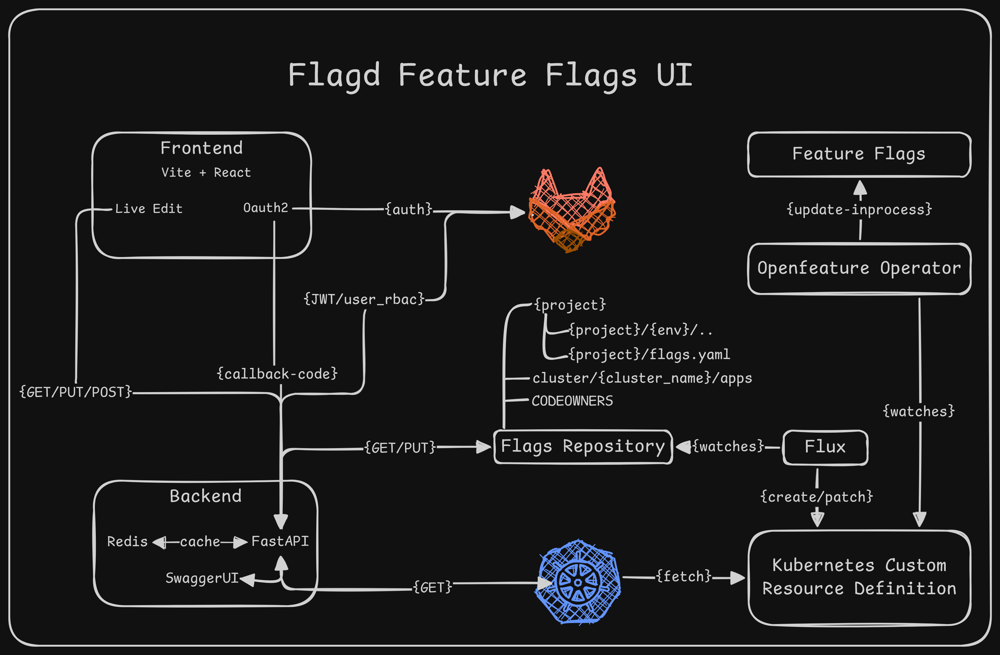

# 🔧 [Feature Flags UI](https://featureflags-ui.bharathrajiv.org)

A full-stack application to centrally manage feature flags using OpenFeature Operator across environments in your Kubernetes EKS cluster. It supports both GitOps-style persistence and direct Kubernetes updates for dynamic preview environments.

---
<h1>
📁 Project Structure
  <a href="https://featureflags-ui-api.bharathrajiv.org/docs/">
    
  </a>
</h1>

```
feature-flag-ui/
├── README.md
├── architecture.png
├── backend
│   ├── Dockerfile
│   ├── git_utils.py
│   ├── k8s_utils.py
│   ├── main.py
│   └── requirements.txt
├── deployment.yaml
├── frontend
│   ├── Dockerfile
│   ├── README.md
│   ├── eslint.config.js
│   ├── index.html
│   ├── nginx.conf
│   ├── package-lock.json
│   ├── package.json
│   ├── public
│   ├── src
│   └── vite.config.js
└── requirements.txt
```

---

## 🚀 Features

- 🔐 GitLab RBAC via Personal Access Token (PAT)
- 📁 List projects and environments from repo structure
- 🧪 Toggle feature flags per env
  - `review-mr-*`: Patches live using Kubernetes API
  - Other envs: Commits to Git `flags.yaml`, picked by Flux
- 🎨 React UI for easy access by dev teams

---

## 🔨 Requirements

### 🖥️ Local Dev
- Python 3.9+
- Node.js 18+
- Git CLI
- `kubectl` configured (for preview env patching)

### Kubernetes
- OpenFeature Operator installed
- Git repo structure like:
```
flags
├── README.md
├── clusters
│   └── mum-dev
│       └── apps
├── create-env.sh
├── delete-env.sh
├── expense-manager-backend
│   ├── _template
│   │   ├── deployment.yaml
│   │   ├── feature-flag-source.yaml
│   │   ├── feature-flags-patch.yaml
│   │   ├── feature-flags.yaml
│   │   ├── inprocess-configuration.yaml
│   │   ├── kustomization.yaml
│   │   └── namespace.yaml
│   ├── expense-manager-backend-alpha
│   │   ├── deployment.yaml
│   │   ├── feature-flag-source.yaml
│   │   ├── feature-flags-patch.yaml
│   │   ├── feature-flags.yaml
│   │   ├── inprocess-configuration.yaml
│   │   ├── kustomization.yaml
│   │   └── namespace.yaml
│   ├── expense-manager-backend-beta
│   │   ├── deployment.yaml
│   │   ├── feature-flag-source.yaml
│   │   ├── feature-flags-patch.yaml
│   │   ├── feature-flags.yaml
│   │   ├── inprocess-configuration.yaml
│   │   ├── kustomization.yaml
│   │   └── namespace.yaml
│   ├── expense-manager-backend-ci
│   │   ├── deployment.yaml
│   │   ├── feature-flag-source.yaml
│   │   ├── feature-flags-patch.yaml
│   │   ├── feature-flags.yaml
│   │   ├── inprocess-configuration.yaml
│   │   ├── kustomization.yaml
│   │   └── namespace.yaml
│   ├── expense-manager-backend-review-mr-67
│   │   ├── deployment.yaml
│   │   ├── feature-flag-source.yaml
│   │   ├── feature-flags-patch.yaml
│   │   ├── feature-flags.yaml
│   │   ├── inprocess-configuration.yaml
│   │   ├── kustomization.yaml
│   │   └── namespace.yaml
│   └── flags.yaml
└── sync-feature-flags.py
```
- Flux or ArgoCD watching `flags/` for changes

---

## ▶️ Running Locally

### Backend (FastAPI)
```bash
cd backend
pip install -r requirements.txt
uvicorn main:app --reload --port 8000
```

### Frontend (React)
```bash
cd frontend
npm install
npm run dev
```

---

## 🌐 API Endpoints (Preview)
- `GET /projects`
- `GET /projects/{project}/envs`
- `GET /flags/{project}/{env}`
- `POST /flags/{project}/{env}`
- `PUT /flags/{project}/{env}`

---

## 🛡️ Authentication (MVP)
Paste your GitLab PAT in the login screen to simulate RBAC. Optional upgrade to OAuth2.

---

## 📦 TODO (Future Improvements)
- ✅ OAuth2 with GitLab groups
- ✅ Role-based access per project
- ✅ Inline flag editing in UI
- ✅ Audit log for changes
- ✅ CI/CD YAML for deployment

---
